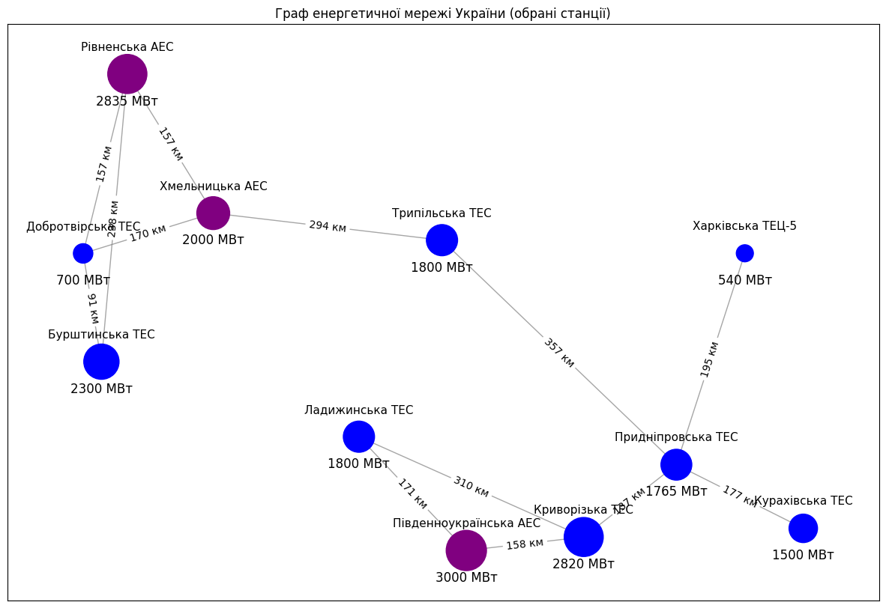

Repository for the homework solution from the GoIT course 'Basic Algorithms and Data Structures', HW-06.

# Вступ

## Вибір мережі для виконання завдання

### 1. Вибір мережі енергетичних об'єктів

Для виконання завдання було обрано мережу енергетичних об'єктів України через її актуальність та значущість. Аналіз та моделювання такої мережі може допомогти зрозуміти критичні вузли та можливі шляхи покращення стабільності та стійкості енергопостачання. Крім того, енергетична мережа є добре документованою та містить чіткі дані про потужності станцій і відстані між ними.

### 2. Принципи вибору вузлів для мережі

Вузли для мережі обиралися на основі наступних критеріїв:
- **Важливість і потужність:** Було відібрано найбільші електростанції, що відіграють ключову роль в енергопостачанні України.
- **Розташування:** Вузли обиралися так, щоб охопити різні регіони країни, забезпечуючи географічну репрезентативність мережі.
- **Доступність даних:** Обиралися об'єкти, для яких є доступні та перевірені дані щодо їх потужності та розташування.

#### Обрані станції

| Станція               | Потужність (МВт) | Широта  | Довгота |
|-----------------------|------------------|---------|---------|
| Бурштинська ТЕС       | 2300             | 49.2066 | 24.6255 |
| Добротвірська ТЕС     |  700             | 50.0046 | 24.2952 |
| Криворізька ТЕС       | 2820             | 47.9142 | 33.3233 |
| Курахівська ТЕС       | 1500             | 47.9780 | 37.2827 |
| Ладижинська ТЕС       | 1800             | 48.6536 | 29.2692 |
| Придніпровська ТЕС    | 1765             | 48.4472 | 34.9943 |
| Південноукраїнська АЕС| 3000             | 47.8148 | 31.2065 |
| Рівненська АЕС        | 2835             | 51.3272 | 25.0928 |
| Трипільська ТЕС       | 1800             | 50.1023 | 30.7673 |
| Харківська ТЕЦ-5      |  540             | 50.0056 | 36.2292 |
| Хмельницька АЕС       | 2000             | 50.3016 | 26.6419 |

Ця таблиця містить обрані станції, їх потужність та географічні координати.

### 3. Вибір кількості ребер до кожного вузла

Кількість ребер до кожного вузла обиралася на основі наступних правил:
- **Пряме сполучення між найближчими вузлами:** З'єднані вузли, які географічно розташовані найближче один до одного.
- **Важливість вузлів:** Великі електростанції мають більше сполучень через їх стратегічне значення.
- **Прямі високовольтні лінії:** Враховувалися високовольтні лінії (наприклад, 750 кВ) для з'єднання важливих вузлів.
- **Логічні маршрути:** З'єднання між вузлами відображають логічні маршрути передачі електроенергії.

### 4. Визначення ваги ребер між вузлами

Ваги ребер між вузлами визначалися на основі географічної відстані між станціями. Це дозволяє створити зрозумілу та логічну модель мережі, де відстань відображає енергетичні витрати на передачу струму між об'єктами.

Для пошуку оптимального способу розрахунку відстаней було проведене дослідження з порівнянням наступних методів:
- бібліотека `geopy`
- бібліотека `haversine`
- власна імплементацією формули гаверсинуса.

З результатами дослідження можна ознайомитись за настпним посиланням (файл: './research/1_Graph_Layout_Comparison.ipynb'):

https://github.com/andriy-pro/goit-algo-hw-06/blob/main/research/1_Graph_Layout_Comparison.ipynb

### 5. Спосіб побудови графу

Для зображення графу у Python можна обирати кілька різних методів. Для вибору оптимального для цього випадку, було проведено порівняння, з результами якого можна ознайомитись за цим посиланням (файл: './research/2_Comparison_of_Geographical_Distance_Calculations.ipynb'):

https://github.com/andriy-pro/goit-algo-hw-06/blob/main/research/2_Comparison_of_Geographical_Distance_Calculations.ipynb


### 6. Граф мережі енергетичних об'єктів України



## Аналіз характеристик графа

1. **Кількість вузлів**: 11  
   Граф має 11 вузлів, кожен з яких відповідає одній із електростанцій в Україні.

2. **Кількість ребер**: 13  
   Мережа включає 13 з'єднань між станціями, які відображають зв'язки між ними.

3. **Середній ступінь вузла**: 2.36


## Аналіз характеристик графа

1. **Кількість вузлів**: 11  
   Граф має 11 вузлів, кожен з яких відповідає одній із електростанцій в Україні.

2. **Кількість ребер**: 13  
   Мережа включає 13 з'єднань між станціями, які відображають зв'язки між ними.

3. **Середній ступінь вузла**: 2.36  
   Середній ступінь вузла, тобто кількість з'єднань на один вузол, дорівнює 2.36. Це означає, що в середньому кожна станція пов'язана з двома-трьома іншими станціями.

4. **Ступінь вузлів**:  
   - Бурштинська ТЕС: 2
   - Добротвірська ТЕС: 3
   - Криворізька ТЕС: 3
   - Курахівська ТЕС: 1
   - Ладижинська ТЕС: 2
   - Придніпровська ТЕС: 3
   - Південноукраїнська АЕС: 2
   - Рівненська АЕС: 3
   - Трипільська ТЕС: 2
   - Харківська ТЕЦ-5: 1
   - Хмельницька АЕС: 3
   
   Деякі станції мають вищий ступінь (3), що вказує на їх важливу роль у мережі (наприклад, Рівненська АЕС, Добротвірська ТЕС).

## Пошук шляхів алгоритмами DFS і BFS

### Імплементація DFS

Алгоритм пошуку в глибину (DFS) було реалізовано за допомогою ітеративного підходу, який використовує явний стек для зберігання вузлів, які потрібно відвідати.

```python
def dfs(graph: Dict[str, List[str]], start: str) -> List[str]:
    visited: Set[str] = set()
    stack: List[str] = [start]
    path: List[str] = []

    while stack:
        node = stack.pop()
        if node not in visited:
            path.append(node)
            visited.add(node)
            stack.extend(graph[node])

    return path
```

### Імплементація BFS

Алгоритм пошуку в ширину (BFS) було реалізовано за допомогою ітеративного підходу, який використовує чергу для зберігання вузлів, що підлягають відвідуванню. Під час виконання алгоритму послідовно відвідуються всі сусідні вузли на поточному рівні, перш ніж перейти до вузлів на наступному рівні, поки не буде відвідано всі вузли графа.


```python
def bfs(graph: Dict[str, List[str]], start: str) -> List[str]:
    visited: Set[str] = set()
    queue: Deque[str] = deque([start])
    path: List[str] = []

    while queue:
        node = queue.popleft()
        if node not in visited:
            path.append(node)
            visited.add(node)
            queue.extend(graph[node])

    return path
```

### Вибір початкового вузла для тестування DFS та BFS

Для тестування методів DFS та BFS як початковий було обрано вузол "Криворізька ТЕС".
Цей вузол є цікавим вибором для тестування з наступних причин:

1. **Ступінь вузла**: Має кілька сусідніх вузлів, зокрема "Ладижинська ТЕС", "Південноукраїнська АЕС", і "Придніпровська ТЕС". Це означає, що є кілька можливих напрямків для дослідження, що робить цей вузол хорошим кандидатом для тестування як DFS, так і BFS.

2. **Центральне розташування**: "Криворізька ТЕС" знаходиться ближче до центру графа і пов'язана з іншими вузлами, які також мають високий ступінь. Це може показати, як обидва алгоритми проходять через центральні вузли і як вони вирішують проблему вибору шляху в багатозв'язних графах.

### Результати пошуку шляхів

**BFS-шлях від 'Криворізька ТЕС':**

Криворізька ТЕС
Ладижинська ТЕС
Південноукраїнська АЕС
Придніпровська ТЕС
Рівненська АЕС
Добротвірська ТЕС
Курахівська ТЕС
Трипільська ТЕС
Харківська ТЕЦ-5
Хмельницька АЕС
Бурштинська ТЕС

**DFS-шлях від 'Криворізька ТЕС':**

Криворізька ТЕС
Ладижинська ТЕС
Південноукраїнська АЕС
Придніпровська ТЕС
Курахівська ТЕС
Трипільська ТЕС
Харківська ТЕЦ-5
Хмельницька АЕС
Добротвірська ТЕС
Рівненська АЕС
Бурштинська ТЕС

### Висновки

1. **Результати пошуку шляхів**: Обидва алгоритми DFS та BFS знайшли шляхи від "Криворізька ТЕС" до всіх інших вузлів у графі. Це показує, що обидва алгоритми працюють правильно та здатні знаходити шляхи в графі.
2. **Порівняння результатів**: Шляхи, знайдені DFS та BFS, відрізняються. DFS зазвичай шукає шляхи в глибину, тоді як BFS шукає шляхи в ширину. Це може призвести до різних результатів, залежно від структури графа та вибору початкового вузла


### Порівняння результатів алгоритмів BFS і DFS

#### BFS-шлях від 'Криворізька ТЕС':
1. **Криворізька ТЕС**
2. Ладижинська ТЕС
3. Південноукраїнська АЕС
4. Придніпровська ТЕС
5. Рівненська АЕС
6. Добротвірська ТЕС
7. Курахівська ТЕС
8. Трипільська ТЕС
9. Харківська ТЕЦ-5
10. Хмельницька АЕС
11. Бурштинська ТЕС

#### DFS-шлях від 'Криворізька ТЕС':
1. **Криворізька ТЕС**
2. Ладижинська ТЕС
3. Південноукраїнська АЕС
4. Придніпровська ТЕС
5. Курахівська ТЕС
6. Трипільська ТЕС
7. Харківська ТЕЦ-5
8. Хмельницька АЕС
9. Добротвірська ТЕС
10. Рівненська АЕС
11. Бурштинська ТЕС

### Аналіз і пояснення

#### BFS (Breadth-First Search)
Алгоритм BFS працює за принципом пошуку в ширину, що означає, що він спочатку досліджує всі сусідні вузли на одному рівні, перш ніж перейти до наступного рівня. Це призводить до того, що BFS відвідує вузли в порядку, який гарантує, що всі найближчі вузли будуть відвідані першими.

- **Порядок відвідування вузлів**: Починаючи з "Криворізька ТЕС", BFS спочатку відвідує всі безпосередньо з'єднані вузли ("Ладижинська ТЕС", "Південноукраїнська АЕС", "Придніпровська ТЕС"). Потім алгоритм переходить до наступних рівнів, відвідує їхніх сусідів, і так далі, поки не буде відвідано всі вузли.
- **Найкоротший шлях у плані кроків**: BFS забезпечує найкоротший шлях (за кількістю кроків) до кожного вузла, що може бути важливим у задачах, де необхідно мінімізувати кількість переходів.

#### DFS (Depth-First Search)
Алгоритм DFS працює за принципом пошуку в глибину, що означає, що він йде по одному шляху до кінця, перш ніж повернутися і дослідити інші шляхи. Це призводить до того, що DFS може "заглибитися" у граф, відвідуючи вузли на глибоких рівнях раніше, ніж вузли на тому ж рівні, що й початковий.

- **Порядок відвідування вузлів**: Починаючи з "Криворізька ТЕС", DFS йде вглиб до "Ладижинська ТЕС", потім до "Південноукраїнська АЕС", і так далі. Алгоритм продовжує йти до найглибших вузлів, поки не досягне кінця одного шляху, потім повертається назад і починає досліджувати інші можливі шляхи.
- **Можливі глибокі шляхи**: DFS може знайти довші або більш заплутані шляхи, оскільки він досліджує глибину графа, перш ніж повернутися і дослідити інші можливості.

### Різниця в отриманих шляхах

- **BFS**: Перші кілька вузлів ("Ладижинська ТЕС", "Південноукраїнська АЕС", "Придніпровська ТЕС") однакові для обох алгоритмів, але після цього BFS переходить до відвідування сусідніх вузлів у тому ж рівні перед тим, як йти далі. Це забезпечує широкий огляд графа, з поступовим зануренням на глибші рівні.
  
- **DFS**: Алгоритм DFS, навпаки, продовжує дослідження вглиб після відвідування кожного вузла. Це призводить до більш глибоких переходів, перш ніж повернутися і дослідити інші гілки графа. Результат цього — порядок відвідування вузлів, який може сильно відрізнятися від BFS після кількох початкових кроків.

### Чому шляхи саме такі?

- **BFS**: Вузли відвідуються за принципом ширини, тому першими відвідуються всі вузли, що знаходяться на однаковій відстані від початкового вузла, і лише потім — вузли на більшій відстані. Це робить BFS найкращим для знаходження найкоротшого шляху в плані кількості переходів.
  
- **DFS**: Вузли відвідуються за принципом глибини, тому алгоритм йде до кінця одного шляху, перш ніж повернутися і дослідити інші можливі шляхи. Це може призвести до того, що DFS знаходить шлях, який проходить через більш глибокі рівні графа раніше, ніж сусідні вузли на тому ж рівні.

### Висновок
BFS і DFS використовують різні стратегії для пошуку шляхів у графі, що призводить до різних результатів, що підтверджують результати тестування. BFS гарантує знаходження найкоротшого шляху в плані кількості кроків, тоді як DFS може досліджувати більш глибокі шляхи, перш ніж повернутися і дослідити інші можливості. Обидва підходи можуть бути корисними в різних контекстах, залежно від вимог задачі.


## Алгоритм Дейкстри

### Імплементація алгоритму Дейкстри

Ця імплементація алгоритму Дейкстри використовує пріоритетну чергу для ефективного вибору наступного вузла з найменшою відстанню. Спочатку всі відстані до вузлів ініціалізуються як нескінченність, крім стартового вузла, відстань до якого дорівнює нулю. Пріоритетна черга зберігає пари (відстань, вузол), і на кожному кроці вибирається вузол з найменшою відстанню. Для кожного сусіда поточного вузла обчислюється нова потенційна відстань, і якщо вона менша за раніше відому, відстань оновлюється, а вузол додається в чергу. Це дозволяє знайти найкоротші шляхи від стартового вузла до всіх інших вузлів у графі.

Ця імплементація алгоритму Дейкстри використовує пріоритетну чергу `priority_queue` для ефективного вибору наступного вузла з найменшою відстанню. Спочатку всі відстані до вузлів ініціалізуються як нескінченність (`float("inf")`) у словнику `distances`, крім стартового вузла `start`, відстань до якого дорівнює нулю. Пріоритетна черга зберігає пари `(відстань, вузол)`, і на кожному кроці вибирається вузол з найменшою відстанню (`current_station`). Для кожного сусіда (`neighbor`) поточного вузла обчислюється нова потенційна відстань `new_distance`, і якщо вона менша за раніше відому, відстань оновлюється, а вузол додається в чергу. Це дозволяє знайти найкоротші шляхи від стартового вузла до всіх інших вузлів у графі.

```python
def dijkstra(
    graph: Dict[str, List[Tuple[str, float]]], start: str
) -> Tuple[Dict[str, float], Dict[str, Optional[str]]]:
    distances = {station: float("inf") for station in graph}
    distances[start] = 0
    priority_queue = [(0, start)]

    while priority_queue:
        current_distance, current_station = heapq.heappop(priority_queue)

        if current_distance > distances[current_station]:
            continue

        for neighbor, weight in graph[current_station]:
            new_distance = current_distance + weight

            if new_distance < distances[neighbor]:
                distances[neighbor] = new_distance
                heapq.heappush(priority_queue, (new_distance, neighbor))

    return distances, previous_nodes
```

### Вивід шляху від початкового вузла до цільового

У наведеній вище імплементації алгоритму Дейкстри ми отримуємо довжину (суму ваг всіх ребер) найкоротшого шляху до кожного з вузлів у графі. Але з яких проміжних кроків (вузлів) складається цей шлях (у цій імплементації) нам невідомо.
З академічною метою зробим доповнення, необхідне для відтворення порядку вузлів найкоротшого шляху.
Для цього:
1) для кожного вузла збережемо його попередника - вузол, який був останнім на найкоротшому шляху до цільового вузла;
2) напишемо функцію "reconstruct_path", що буде відтворювати (проходячи у зворотньому порядку) шлях, який алгоритм Дейкстри визначив як найкоротший.

Доповнена функція Дейкстри:

```python
def dijkstra(
    graph: Dict[str, List[Tuple[str, float]]], start: str
) -> Tuple[Dict[str, float], Dict[str, Optional[str]]]:
    distances = {station: float("inf") for station in graph}
    distances[start] = 0
    priority_queue = [(0, start)]

    # Ініціалізація cловника попередників для відновлення шляху
    previous_nodes = {station: None for station in graph}

    while priority_queue:
        current_distance, current_station = heapq.heappop(priority_queue)

        if current_distance > distances[current_station]:
            continue

        for neighbor, weight in graph[current_station]:
            new_distance = current_distance + weight

            if new_distance < distances[neighbor]:
                distances[neighbor] = new_distance

                # Зберігаємо вузол, який був попереднім
                previous_nodes[neighbor] = current_station
                heapq.heappush(priority_queue, (new_distance, neighbor))

    return distances, previous_nodes
```

Словник `previous_nodes` зберігає інформацію про попередника кожної вершини на найкоротшому шляху від стартової вершини.

Як `previous_nodes` заповнюється під час роботи алгоритму:

1. **Ініціалізація**: На початку всі значення в `previous_nodes` встановлюються в `None`, оскільки ми ще не знаємо попередників.

   ```python
   previous_nodes = {station: None for station in graph}
   ```

2. **Оновлення під час обходу**: Коли алгоритм знаходить коротший шлях до вершини `neighbor`, через вершину `current_station`, він оновлює `previous_nodes[neighbor]` на `current_station`.
   ```python
   previous_nodes[neighbor] = current_station
   ```

**Приклад**

Розглянемо граф:

```
A--1--B
|    /|
4  2  5
| /   |
C--1--D
```

- Починаємо з вершини `A`.
- `previous_nodes` виглядає так: `{'A': None, 'B': None, 'C': None, 'D': None}`.
- Знаходимо шлях `A -> B` з вагою 1: `previous_nodes['B'] = 'A'`.
- Знаходимо шлях `A -> C` з вагою 4: `previous_nodes['C'] = 'A'`.
- Знаходимо шлях `B -> C` з вагою 2: `previous_nodes['C'] = 'B'` (оновлюємо, бо шлях коротший).
- Знаходимо шлях `C -> D` з вагою 1: `previous_nodes['D'] = 'C'`.

Після виконання алгоритму `previous_nodes` буде: `{'A': None, 'B': 'A', 'C': 'B', 'D': 'C'}`.

#### Функція `reconstruct_path`

Функція `reconstruct_path` використовується для відновлення шляху від стартової вершини до заданої кінцевої вершини, використовуючи словник `previous_nodes`.

Як працює `reconstruct_path`:

1. **Ініціалізація шляху**: Починаємо з кінцевої вершини і додаємо її до списку `path`.
   ```python
   path = []
   current = end
   ```

2. **Відновлення шляху**: Рухаємося назад по шляху, використовуючи `previous_nodes`, поки не дійдемо до `None` (що означає стартову вершину).
   ```python
   while current is not None:
       path.append(current)
       current = previous_nodes[current]
   ```

3. **Реверс шляху**: Оскільки ми йшли від кінця до початку, потрібно перевернути список `path`.
   ```python
   path.reverse()
   ```

4. **Перевірка шляху**: Якщо початок шляху не є стартовою вершиною, це означає, що шлях не знайдено, і ми повертаємо порожній список.
   ```python
   if path[0] == start:
       return path
   else:
       return []
   ```

#### Приклад:

Припустимо, ми хочемо знайти шлях з `A` до `D`.

- Починаємо з `D`, додаємо до `path`: `['D']`.
- Попередник `D` - `C`, додаємо до `path`: `['D', 'C']`.
- Попередник `C` - `B`, додаємо до `path`: `['D', 'C', 'B']`.
- Попередник `B` - `A`, додаємо до `path`: `['D', 'C', 'B', 'A']`.
- Перевертаємо `path`: `['A', 'B', 'C', 'D']`.

Отримуємо шлях `A -> B -> C -> D`.

**Результати роботи алгоритму Дейкстри з відновленням шляху для початкового вузла "Бурштинська ТЕС"**

```
Відстань до станції 'Бурштинська ТЕС': 0.00 км
Бурштинська ТЕС

Відстань до станції 'Добротвірська ТЕС': 91.87 км
Бурштинська ТЕС -> Добротвірська ТЕС

Відстань до станції 'Криворізька ТЕС': 1051.60 км
Бурштинська ТЕС -> Добротвірська ТЕС -> Хмельницька АЕС -> Трипільська ТЕС -> Придніпровська ТЕС -> Криворізька ТЕС

Відстань до станції 'Курахівська ТЕС': 1091.67 км
Бурштинська ТЕС -> Добротвірська ТЕС -> Хмельницька АЕС -> Трипільська ТЕС -> Придніпровська ТЕС -> Курахівська ТЕС

Відстань до станції 'Ладижинська ТЕС': 1362.60 км
Бурштинська ТЕС -> Добротвірська ТЕС -> Хмельницька АЕС -> Трипільська ТЕС -> Придніпровська ТЕС -> Криворізька ТЕС -> Ладижинська ТЕС

Відстань до станції 'Придніпровська ТЕС': 914.27 км
Бурштинська ТЕС -> Добротвірська ТЕС -> Хмельницька АЕС -> Трипільська ТЕС -> Придніпровська ТЕС

Відстань до станції 'Південноукраїнська АЕС': 1209.90 км
Бурштинська ТЕС -> Добротвірська ТЕС -> Хмельницька АЕС -> Трипільська ТЕС -> Придніпровська ТЕС -> Криворізька ТЕС -> Південноукраїнська АЕС

Відстань до станції 'Рівненська АЕС': 238.13 км
Бурштинська ТЕС -> Рівненська АЕС

Відстань до станції 'Трипільська ТЕС': 556.71 км
Бурштинська ТЕС -> Добротвірська ТЕС -> Хмельницька АЕС -> Трипільська ТЕС

Відстань до станції 'Харківська ТЕЦ-5': 1109.38 км
Бурштинська ТЕС -> Добротвірська ТЕС -> Хмельницька АЕС -> Трипільська ТЕС -> Придніпровська ТЕС -> Харківська ТЕЦ-5

Відстань до станції 'Хмельницька АЕС': 262.29 км
Бурштинська ТЕС -> Добротвірська ТЕС -> Хмельницька АЕС
```